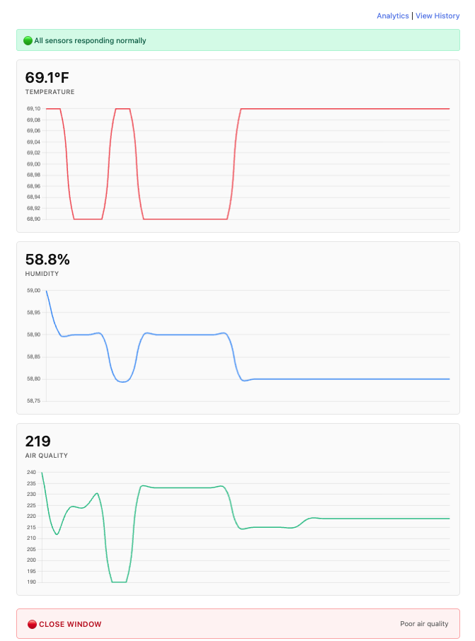

# Window Monitor
**Real-Time Environmental Monitoring & Decision System**

Full-stack IoT system with embedded firmware, Flask backend, and React dashboard. Monitors temperature, humidity, and air quality to provide intelligent window recommendations.

**Built in one week** to explore hardware-software integration and systems architecture.

---

## 🎯 **Highlights**

- ✅ **Full-stack IoT** - ESP32 firmware → Flask API → React dashboard
- ✅ **Real hardware** - DHT22 + MQ-135 sensors on ESP32
- ✅ **Smart logic** - Hysteresis prevents flip-flopping, validation catches bad data
- ✅ **3 pages** - Live dashboard, history table, analytics charts
- ✅ **Professional** - SQLite database, unit tests (pytest), CSV export

---

## 🏗️ **Architecture**
```
ESP32 + Sensors  →  Flask API  →  React Dashboard
(Embedded C++)      (Python)      (JavaScript)
     ↓                  ↓              ↓
  Serial JSON      SQLite DB    Chart.js Graphs
```

---

## 🛠️ **Tech Stack**

**Hardware:** ESP32 Feather, DHT22, MQ-135  
**Firmware:** C++ (PlatformIO)  
**Backend:** Python, Flask, SQLite, pytest  
**Frontend:** React, Vite, Chart.js  

---

## ✨ **Key Features**

**Dashboard:**
- Live sensor readings (updates every 2 seconds)
- 60-second trend graphs for temp/humidity/air quality
- OPEN/CLOSE recommendation with reasoning
- Sensor health status badge

**History:**
- Paginated data table (50-1000 readings)
- Warning indicators for invalid data
- Downloadable CSV export

**Analytics:**
- Statistical summary (min/max/avg)
- Large historical trend charts
- Filters invalid readings from calculations

**Engineering:**
- **Hysteresis logic** - ±2°F/5%/50 stability windows prevent oscillation
- **Data validation** - Detects out-of-range sensor values
- **Multi-threading** - Concurrent serial reading + API serving
- **Error handling** - Auto-reconnection, validation feedback

---

## 🚀 **Running the Project**
```bash

**Note:** Requires ESP32 hardware with DHT22 and MQ-135 sensors. See hardware setup below.
# Backend
cd backend && pip3 install -r requirements.txt && python3 app.py

# Frontend  
cd frontend && npm install && npm run dev

# Firmware
cd firmware && pio run --target upload
```

**Dashboard:** http://localhost:5173  
**API:** http://localhost:5001

---

## 🧪 **Testing**
```bash
cd backend
python3 -m pytest test_logic.py -v
# 9 tests: validation, hysteresis, stats filtering
```

---

## 📸 **Screenshots**


*Live sensor readings with trend graphs*


*ESP32 + DHT22 + MQ-135 on breadboard*

---

## 🧠 **Decision Logic**

**Thresholds:**
- Temperature: 60-78°F
- Humidity: <70%
- Air Quality: >500

**Hysteresis windows** prevent flip-flopping:
- Currently OPEN → needs temp >80°F to close (78+2)
- Currently CLOSED → needs temp <76°F to open (78-2)

Same logic for humidity and air quality.

---

## 📊 **API Endpoints**
```
GET /api/latest         # Current readings + recommendation
GET /api/readings       # Historical data (paginated)
GET /api/stats          # Min/max/avg statistics
GET /api/export         # Download CSV
GET /api/sensor-health  # Sensor status
```

---

## 🎓 **What I Learned**

**Systems:**
- Multi-layer debugging (firmware → backend → frontend)
- REST API design with pagination
- Control systems (hysteresis implementation)

**Hardware:**
- Serial communication and JSON protocols
- Quality matters (swapped ESP32 after cheap one failed)
- Sensor precision limits affect validation logic

**Data:**
- False positives taught me to tune validation (DHT22 precision = ±1°F)
- Filtering invalid readings from statistics
- Time-series data handling

---

## 📁 **Project Structure**
```
backend/          Flask API, database, validation, tests
frontend/         React dashboard, history, analytics
firmware/         ESP32 C++ code
data/            SQLite database
```

---

## 📄 **License**

MIT

---

Built by Killian - Exploring systems engineering and IoT