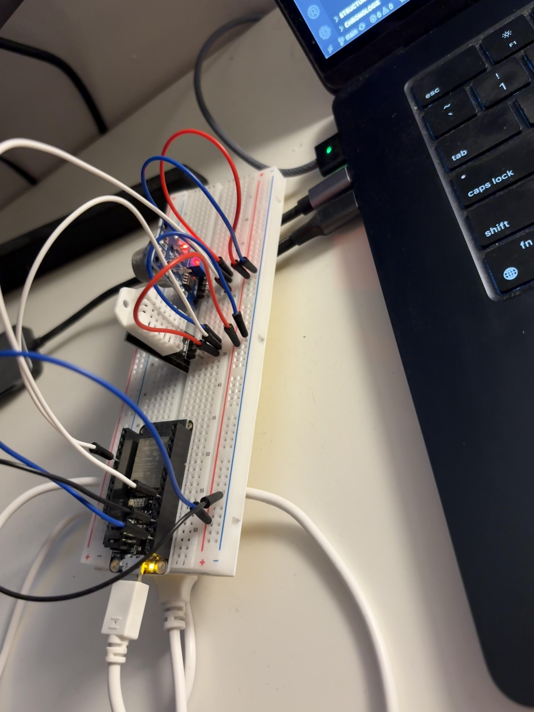

# MK.1 – Environmental Monitoring & Decision System

## Overview
Monitors temperature, humidity, and air quality to recommend when to open or close your window. Built to explore full-stack IoT architecture - from embedded firmware to web dashboard.

## Tech Stack
- **Firmware:** Embedded C++ on ESP32 (PlatformIO)
- **Backend:** Python Flask REST API with multi-threading
- **Frontend:** React/Vite + Chart.js
- **Hardware:** DHT22 (temp/humidity), MQ-135 (air quality)

## Architecture
ESP32 → USB Serial → Flask Backend REST API  → SQLite DB → React/Vite Dashboard

## Features
- Real-time sensor readings (2s intervals)
- Live trend graphs (60s of data)
- Threshold-based OPEN/CLOSE recommendations
- Error handling and reconnection logic

## Decision Logic
**Thresholds:**
- Temperature: 60-78°F
- Humidity: < 70%
- Air Quality: > 500

- If any threshold violated -> **CLOSE**
- All favorable -> **OPEN**

**Stability Window:**
- To do

## How to Run Locally
- backend: cd backend -> pip3 install -r requirements.txt -> python3 app.py
- frontend: cd frontend -> npm install -> npm run dev
- firmware: upload via PlatformIO to ESP32

## ESP32 / Breadboard / Sensors / Wiring

## Build notes

### Completed (Scope for intensive)
- ESP32 firmware reading 2 sensors (3 readings)
- Python Flask REST API
- Real-time React/Vite dashboard
- Live sensor values
- 3 live-updating graphs
- OPEN/CLOSE recommendation logic
- UI

### To Do

#### Core Features:
- [x] SQLite database
- [x] Historical data page (/history) with date filters
- [x] Analytics page with basic stats
- [ ] Better decision logic:
    - [ ] Hysteresis (prevent flip-flopping)
    - [ ] Trend arrows (rising/falling)
    - [ ] Rolling averages (5min, 30min)
- [ ] More REST endpoints:
    - [ ] /api/readings?start=X&end=Y
    - [x] /api/stats
    - [ ] /api/export
- [ ] Unit tests (pytest) for decision logic
- [ ] Export data (CSV)

#### Polish:
- [ ] Weather API integration
- [ ] Data validation (detect bad sensor readings)
- [ ] Dark mode
- [ ] Demo video (2-3 min)

#### Maybe Later:
- [ ] Alert system
- [ ] System diagnostics
- [ ] FastAPI migration